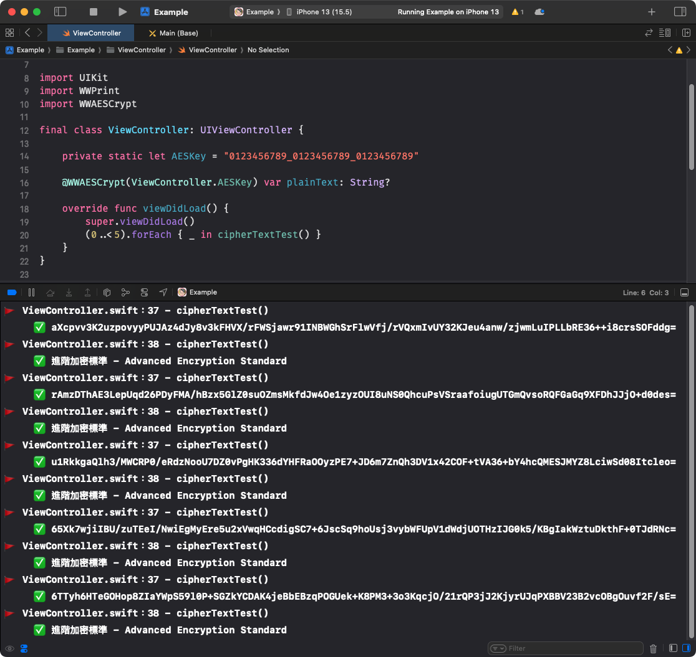

# WWAESCrypt

[](https://developer.apple.com/swift/) [](https://developer.apple.com/swift/)  [](https://developer.apple.com/swift/) [](https://developer.apple.com/swift/)

## [Introduction - 簡介](https://swiftpackageindex.com/William-Weng)
- Use Swift's native CommonCrypto to implement [AES](https://en.wikipedia.org/wiki/Advanced_Encryption_Standard) encryption.
- 使用Swift原生CommonCrypto實現[AES](https://zh.wikipedia.org/zh-tw/高级加密标准)加密。

## [Achievements display - 成果展示](https://www.hkweb.com.hk/blog/ui設計基礎知識：引導頁對ui設計到底有什麼作用/)


## [Installation with Swift Package Manager - 安裝方式](https://medium.com/彼得潘的-swift-ios-app-開發問題解答集/使用-spm-安裝第三方套件-xcode-11-新功能-2c4ffcf85b4b)

```bash
dependencies: [
    .package(url: "https://github.com/William-Weng/WWAESCrypt.git", .upToNextMajor(from: "1.0.0"))
]
```

## Function - 可用函式

|函式|功能|
|-|-|
|@WWAESCrypt()|Encrypt / 加密|
|WWAESCrypt.decoding(base64EncodedString:forKey:)|Decrypt / 解密|

## Example - 程式範例
```swift
import UIKit
import WWPrint
import WWAESCrypt

final class ViewController: UIViewController {

    private static let AESKey = "0123456789_0123456789_0123456789"
    
    @WWAESCrypt(ViewController.AESKey) var plainText: String?
    
    override func viewDidLoad() {
        super.viewDidLoad()
        (0..<5).forEach { _ in cipherTextTest() }
    }
}

// MARK: - 小工具
private extension ViewController {
    
    /// 加解密測試
    func cipherTextTest() {
        
        plainText = "進階加密標準 - Advanced Encryption Standard"
        
        guard let cipherText = plainText,
              let decodingText = WWAESCrypt.decoding(base64EncodedString: plainText, forKey: ViewController.AESKey)
        else {
            return
        }
        
        wwPrint(cipherText)
        wwPrint(decodingText)
    }
}
```
